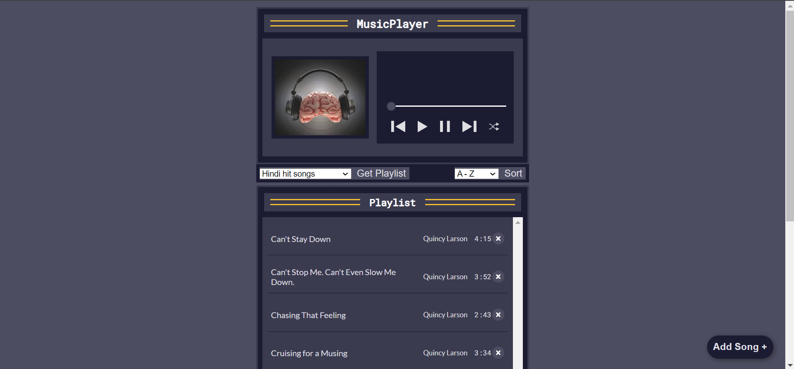
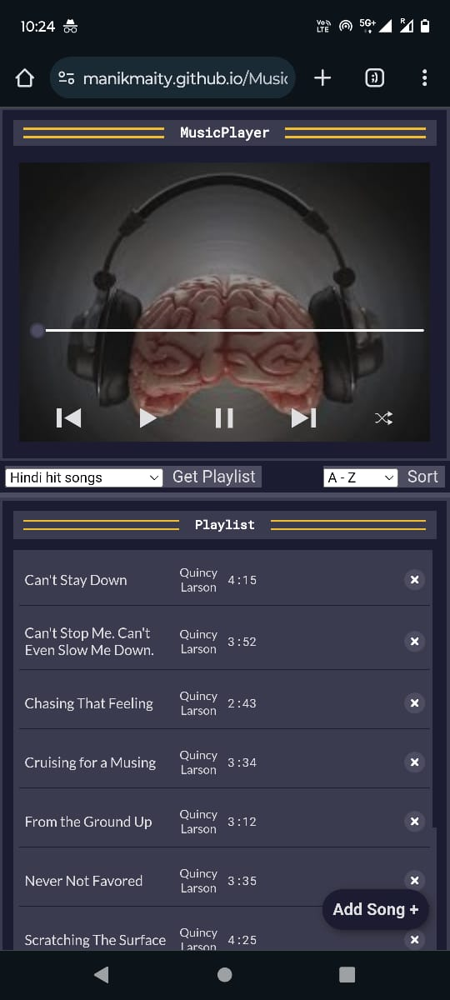

# Music App
🎵 A sleek and user-friendly music app built with HTML, CSS, and vanilla JavaScript. Enjoy essential music features like play, pause, skip, and shuffle, along with playlist management, new song fetching, detailed song information, and customizable sorting options. Dive into a seamless music experience with intuitive controls and a clean interface.

## Table of Contents

- [Description](#description)
- [Preview](#preview)
- [Demo](#demo)
- [Features](#features)  <!-- Add Features Section -->
- [Technologies Used](#technologies-used)
- [Usage](#usage)
- [Acknowledgments](#acknowledgments)
- [Contact](#contact)

---

## Description

🎵 A sleek and user-friendly music app built with HTML, CSS, and vanilla JavaScript. Enjoy essential music features like play, pause, skip, and shuffle, along with playlist management, new song fetching, detailed song information, and customizable sorting options. Dive into a seamless music experience with intuitive controls and a clean interface.

---

## Preview

### Desktop Preview

### Mobile Preview

---

## Demo

[Link to Live Demo](https://manikmaity.github.io/Music-App/)

You can see the project in action by visiting the [live demo](https://manikmaity.github.io/Music-App/).

---

## Features

Here are some key features of this app:

- 🎵 Play, pause, skip, and shuffle songs with ease.
- 📸 Dynamic song details including title, artist, duration, and album art.
- 📜 Interactive playlist functionality – play or remove songs with a click. 
- 🎧 Explore different playlists and switch seamlessly between them. 
- ⏱ Customize your playlist sorting by title or duration. 
- 🔄 Progress bar for precise song navigation. 
- 🎶 Add any song to your playlist effortlessly with just the name. 

---

## Technologies Used

- HTML
- CSS
- JavaScript

---

## Usage

### Installation
1. Clone the repository to your local machine using `git clone`.
2. Navigate to the project directory.

### Running the App
1. Open the `index.html` file in your preferred web browser.

### Basic Controls
- Use the play button to start playback, pause button to pause, and skip buttons to navigate
between songs.
- Click the shuffle button to randomize the playlist order.

### Playlist Management
- Get a new playlist by clicking the "Get Playlist" button after selecting from options and songs of that playlist will be fetched.
- Remove songs from the playlist by clicking the "cross sign" button next to each song.

### Sorting and Filtering
- Sort songs alphabetically by clicking the "Sort A-Z" button or "Sort Z-A" button.
- Sort songs by duration using the "Sort by Duration" button.

### Customization
- Click the "Add song" button to add your favorite songs to the playlist by entering the song name in input field and clicking "Add".

### Progress Bar
- Use the progress bar to navigate to specific parts of a song by clicking on the desired position.

### Exploring Playlists
- Browse through the available playlists and discover new music genres by selecting different
playlists from the dropdown menu

---

## Acknowledgments

This project wouldn't be possible without the following:

[Song API](https://github.com/sumitkolhe/jiosaavn-api)

---

## Contact

- Manik Maity -[manikmaity010@gmail.com]
- [My LinkedIn](https://www.linkedin.com/in/manikmaity/)

---

**Note**: This project is for educational and demonstration purposes. All songs used in the project are belongs to its respective owner, I used it for educational purpose. It is not affiliated with or endorsed by anyone.

